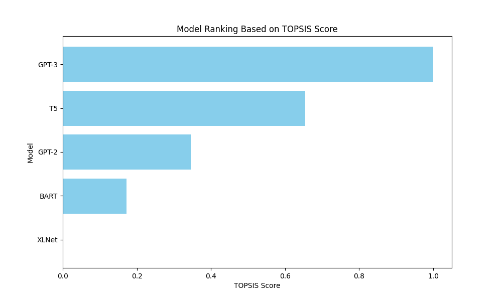

# TOPSIS for Text Generation Model Selection

## Overview
This project applies the **TOPSIS (Technique for Order of Preference by Similarity to Ideal Solution)** method to evaluate and rank different pre-trained text generation models based on multiple performance criteria.

## Dataset
The script uses a dataset containing performance metrics of various text generation models:
- **Accuracy**
- **Fluency**
- **Coherence**

Example models included: **GPT-3, T5, GPT-2, XLNet, and BART**.

## Requirements
Ensure you have the following Python libraries installed:
```bash
pip install numpy pandas scikit-learn matplotlib
```

## Running the Script
Execute the script using:
```bash
python topsis_text_generation.py
```
This will compute the **TOPSIS scores** and rank the models accordingly.

## Output
The results are saved in:
```
topsis_text_generation_results.csv
```
and displayed in the terminal as a ranked list of models based on their **TOPSIS Score**.

A bar chart visualization of the ranked models is also generated and saved as:
```
topsis_score_plot.png
```

## Methodology
1. **Normalize** the dataset using Min-Max scaling.
2. **Apply weights** to different criteria.
3. **Determine ideal & negative-ideal solutions.**
4. **Compute separation measures.**
5. **Calculate TOPSIS score** and rank models.


## Visualization
A graphical representation of the model rankings is available:



## Contribution
Feel free to modify weights or add new models. Contributions are welcome!

